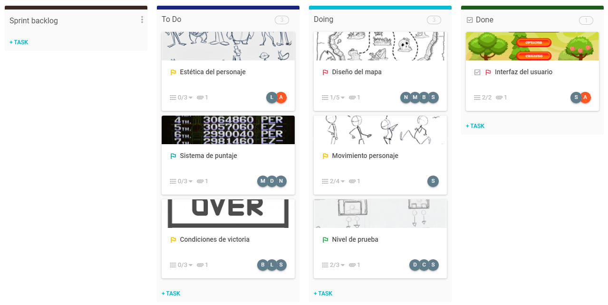

# Hackeando nuestro ADN
Según el reto propuesto y la metodología Agile se desarrolló un ejemplo sobre la creación de un videojuego tipo shooter en una escala muy simple pero explicativa.
## Product Backlog
Aquí podemos ver que se utiliza una lista interactiva en la cual tiene todo lo necesario para abortar toda la información significativa con lo es:
* Tarea general
* Los encargados
* Prioridad
```
 - Alta:Roja. La cual va desde 8 a 10
 - Media:Amarillla. La cual va desde 6 a 7
 - Normal:Verde. 3 a 5
 - Baja:Azul. La cual va desde 1 a 2 
 ```
* Tiempo
* Fecha


## Sprint Backlog
Aquí podemos ver que se sigue un poco el estandar pero hay cosas que hacen que sea mas interactivo y dinámico como las imágenes que describen la tarea y sus respectivos estados.
* Tarea general
* Los encargados
* Subtareas
* Estado subtareas
```
 - Azul:Por hacer.
 - Verde:En progreso.
 - Negro:Hecha.
 ```
* Imágenes
* Etapas y cantidad de tareas en cada una

Tablero comprimido

Tablero extendido

### Tareas
* Estética del personaje

* Sistema de puntaje

* Condición de victoria

* Diseño de mapa

* Movimiento de personaje

* Nivel de prueba

* Interfaz de usuario

## Visión general Proyecto
Tenemos un resumen o visión del proyecto en donde podemos ver:
* Progreso de tareas
* El numero y prioridad de las tareas
* Cantidad y tareas asignadas a cada persona
* Tareas que se han excedido de tiempos
* Comparación entre tiempos

## Miembros
Quise añadir esto ya que es importante saber quienes están asignados al proyecto y su determinado rol.

## Burndown chart
Es una idea de como sería de una manera más facil de entender.

## Calendario
Es una idea y secuencia de tareas a lo largo del mes.

## Autor
- Sergio Alejandro Peña Pinto - Asesoftware
